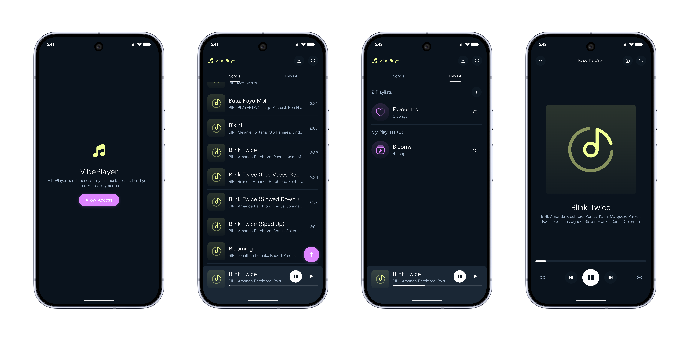

# VibePlayer
VibePlayer is an offline music player that uses Media3.



# Download
Go to [Releases](https://github.com/riley0521/VibePlayer/releases) to download the app.

# Features
- Library
  - Songs Tab - shows all the songs scanned from your Music folder
  - Playlist Tab - shows all the songs you added to Favorites, and your custom playlists.
  - Search the song by title or artist.
- Mini Player & Player
  - Shows the currently playing song
  - Play/pause the song
  - You can toggle the shuffle and repeat mode
  - Skip to previous/next song
  - Add the song to your custom playlist
  - Add the song to favorites

# Tech Stack
- Minimum SDK Level 28 for Android.
- [Kotlin](https://kotlinlang.org/) based, utilizing [Coroutines](https://github.com/Kotlin/kotlinx.coroutines) + [Flow](https://kotlin.github.io/kotlinx.coroutines/kotlinx-coroutines-core/kotlinx.coroutines.flow/) for asynchronous operations.
- Jetpack Libraries:
    - Jetpack compose: Android’s modern toolkit for declarative UI development.
    - Lifecycle: Observes Android lifecycles and manages UI states upon lifecycle changes.
    - ViewModel: Manages UI-related data and is lifecycle-aware, ensuring data survival through configuration changes.
    - Navigation: Facilitates screen navigation, complemented by [Koin](https://insert-koin.io/) for dependency injection.
    - Room: Constructs a database with an SQLite abstraction layer for seamless database access.
- Architecture:
    - MVVM Architecture (View - ViewModel - Model): Facilitates separation of concerns and promotes maintainability.
- [KotlinX Serialization](https://github.com/Kotlin/kotlinx.serialization) - Used for serialization/deserialization of JSON and for navigation as well.
- [ksp](https://github.com/google/ksp): Kotlin Symbol Processing API for code generation and analysis.
- [Koin](https://insert-koin.io/) - Used for dependency injection.
- [Media3](https://developer.android.com/media/media3) - Jetpack Media3 is the new home for media libraries that enables Android apps to display rich audio and visual experiences.
- [AssertK](https://www.google.com/url?sa=t&source=web&rct=j&opi=89978449&url=https://github.com/assertk-org/assertk&ved=2ahUKEwi5ksbpu_-WAxXtTmwGHUPuNlYQFnoECA8QAQ&usg=AOvVaw2Fa0_kBNxD9io0Yp4vlZDC) - Kotlin-first assertion library.
- [Turbine3](https://www.google.com/url?sa=t&source=web&rct=j&opi=89978449&url=https://github.com/cashapp/turbine&ved=2ahUKEwjpgcTuu_-WAxUWXWwGHS3wHbkQFnoECBAQAQ&usg=AOvVaw3h0P0fqi-KwnNne9p2Czxm) - For testing flows.

# Multi-module approach
- core
  - data - Depends on core:domain
  - database - Database setup, Entities, DAOs can be found here.
  - design-system - You can find the theming, and reusable components here.
  - domain
  - player - You can find the Playback service here and the implementation of MusicPlayer to keep the service + Mini Player + Player screen state in sync.
  - presentation - UI Utilities like UiText, ObserveAsEvents, DataErrorToUiText, etc. 
  - testing - Needed to add this because the fake implementation are starting to duplicate due to multi-module setup.
- feature
  - library
  - permission
  - player

# Build and run
You can fork this repository and follow the steps below:
- No additional setup required. Just hit run in your [Android Studio](https://developer.android.com/studio).

Happy coding :D

# License
```xml
Copyright 2026 Riley Farro

Licensed under the Apache License, Version 2.0 (the "License");
you may not use this file except in compliance with the License.
You may obtain a copy of the License at

   http://www.apache.org/licenses/LICENSE-2.0

Unless required by applicable law or agreed to in writing, software
distributed under the License is distributed on an "AS IS" BASIS,
WITHOUT WARRANTIES OR CONDITIONS OF ANY KIND, either express or implied.
See the License for the specific language governing permissions and
limitations under the License.
```